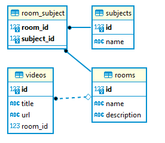

## Application for studying typeorm

## To run the project:
### npm install

## Inside the project run the command:
### docker-compose up db

## After that, create the database with the name of the DB_NAME variable in the env file

## Now delete the files from the migration folder and run the commands below:

### npm run migration:generate
### npm run migration:run

## After that run the command:
### npm run dev

